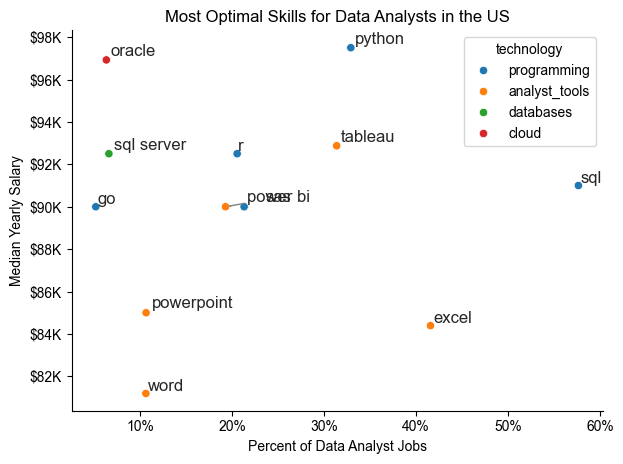

# The Analysis

## 1. What are the most demanded skills for the top 3  most popular data roles?

To find the most demanded skills for the top 3 most popular data roles. I filtered out those positions by which ones were the most popular, and got the top 5 skills for these top 3 roles. This query highlights the most popular job titles and their top skills, showing which skills i should pay attention to depending on the role I'm targeting.

View my notebook with detailed steps here:
Python_Data_Project\3_Project\2_Skills_Demand.ipynb

```python
fig, ax = plt.subplots(len(job_titles), 1)

for i, job_title in enumerate(job_titles):
    df_plot = df_skills_perc[df_skills_perc['job_title_short'] == job_title].head(5)[::-1]
    sns.barplot(data=df_plot, x='skill_percent', y='job_skills', ax=aax[i], hue='skill_count', palette='dark:b_r')

plt.show()
```

### Results


### Insights
- Python is a versatile skill, highly demanded across all three roles, but most prominently for Data Scientists (72%) and Data Engineers (65%).
- SQL is the most requested skill for Data Analysts and Data Scientists, with it in over half the job postings fr both roles. For Data Engineers, Python is the most sought after skill, appearing in 68% of job postings.
- Data Engineers require more specialized technical skills (AWS, Azure, Spark) compared to Data Analysts and Data Scientists who are expected to be proficient in more general data management and analysis tools(Excel, Tableau).


## 2. How are in-demand skills trending for Data Analyst?

### Visualize Data

```python

from matplotlib.ticker import PercentFormatter

df_plot = df_da_u_percent.iloc[:,:5]
sns.lineplot(data=df_plot, dashes=False, legend='full', palette='tab10')

ax = plt.gca()
ax.yaxis.set_major_formatter(PercentFormatter(decimals=0))

plt.show()

```
### Results


*Bar graph visualizing the trending top skills for data analysts in the US in 2023.*

### Insights:
- SQL remains the most consistently demanded skill throughout the year, although it shows a gradual decrease in demand.
- Excel experienced a significant increase in demand starting around November.
- Both Python and Tableau show relatively stable demand throuughout the year with some fluctuations but remain essential skills for data analysis. Sas, while less demanded compared to the others, shows a slight upward trend towards the year's end.

## 3. How well do jobs and skills pay for Data Analysts?

### Salary Analysis for Data Nerds

#### Visualize Data

```python
sns.boxplot(data=df_us_top6, x='salary_year_avg', y='job_title_short',order=job_order)
ax= plt.gca()
ax.xaxis.set_major_formatter(plt.FuncFormatter(lambda x, pos: f'${int(x/1000)}K'))
plt.show()

```
#### Results


*Box plot visualizing the salary distribution for the top 6 data job titles.*

#### Insights
- There is a significant variation insalary ranges across different job titles. Senior Data Scientists positions tend to have the highest salary potential, with up to $600K, indicating the high value placed on advanced data skills and experience in the industry.

- Senior Data Engineer and Senior Data Scientist roles show a considerable number of outliers on the higher end of the salary spectrum, suggesting taht exceptional skills or circumstances can lead to high pay in these roles. In contrast, Data Analyst roles demonstrate more consistency in salary, with fewer outliers.

- The median salaries increase with the seniority  and specialization of the roles. Senior roles (Senior Data Scientsist, Senior Data Engineer) not only have higher median salaries but also larger differences in typical salaries, reflecting greater variance in compensation as responsibilities increase.

### Highest Paid & Most Demanded Skills for Data Analysts

#### Visualize Data

```python

# Top 10 Highest Paid Skills for Data Analysts
sns.barplot(data=df_da_top_pay, x='median',y=df_da_top_pay.index, ax=ax[0],hue='median',palette='dark:b_r')

# Top 10 Most In-Demand Skills for Data Analysts
sns.barplot(data=df_da_skills, x='median',y=df_da_skills.index, ax=ax[1], hue='median',palette='light:b')

plt.show()

```

#### Results

Here's the breakdown of the highest paid and most in-demand skills for data analysts in the US:


*Two separate bar graphs visualizing the highest paid skills and most in-demand skills for data analysts in the US.*

#### Insights:

- The top graph shows specialized technical skills like 'dplyr', 'Bitbucket' and 'Gitlab' are associated with higher salaries, some reaching up to $200K, suggesting that advanced technical proficiency can increase earning potential.

- The bottom graph highlights that foundational skills like 'Excel', 'Powerpoint' and 'SQL' are the most in-demand, even though they may not offer the highest salaries. This demonstrates the importance of these core skills for employability in data analysis roles.

- There is a clear distinction between the skills that are highest paid and those that are most in-demand. Data analysts aiming to maximize their career potential should consider developing a diverse skill set that includes both high-paying specialized skills and widely demanded foundational skills.

## 4. What is the most optimal skill to learn for Data Analysts?

#### Visualize data

```python
from adjustText import adjust_text
import matplotlib.pyplot as plt

plt.scatter(df_da_skills_high_demand['skill_percent'], df_da_skills_high_demand['median_salary'])
plt.show()

```
#### Results



*A scatter plot visualizing the most optimal skills (high paying & high demand) for data analysts in the US*

#### Insights:
- The scatter plot shows that most of the 'programming' skills (colored blue) tend to cluster at higher salary levels compared to other categories, indicating that programming expertise might offer greater salary benefits within the data analytics field.

- Analyst tools(colored green), including Tableau and Power BI, are prevalent in job postings and offer competitive salaries, showing that visualization and data software are crucial for current data roles. This category not only has good salaries but is also versatile across different types of data tasks.  

- The database skills (colored orange), succh as Oracle and SQL server, are associated with some of the highest salaries among data analyst tools. This indicates a significant demand and valuation for data management and manipulation expertise in the industry.

